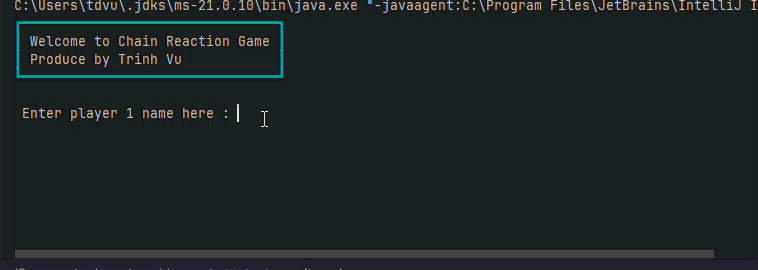
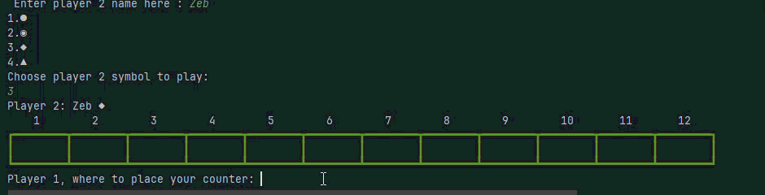
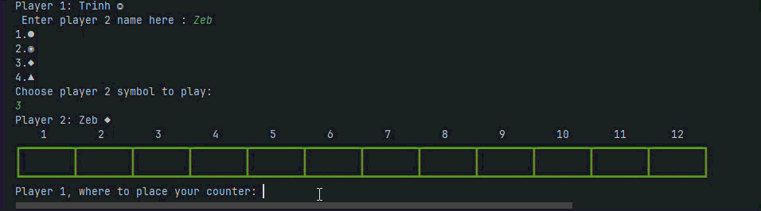
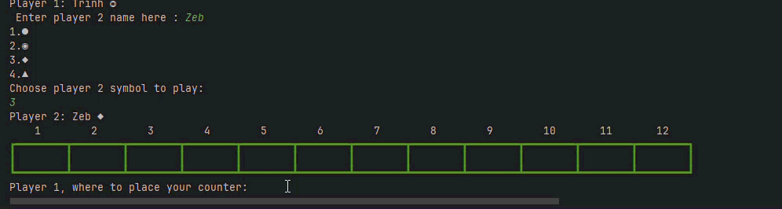
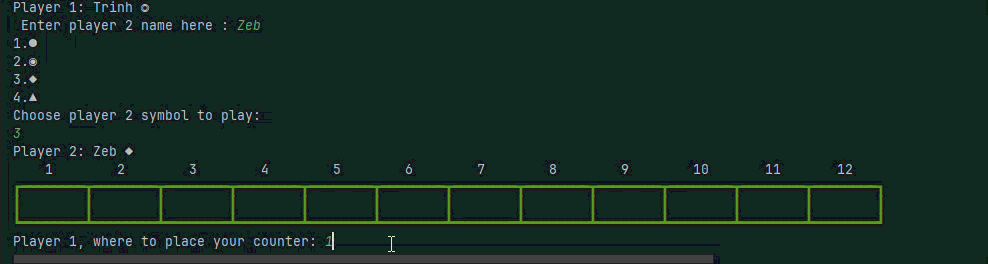
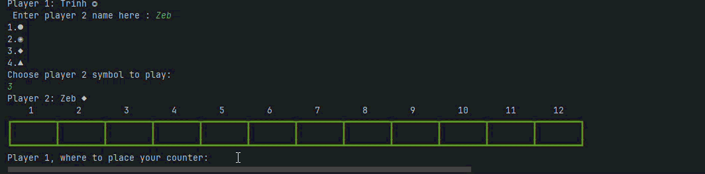
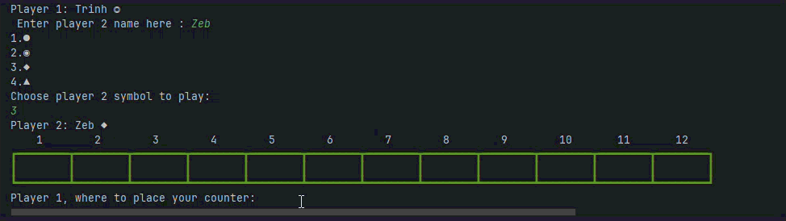
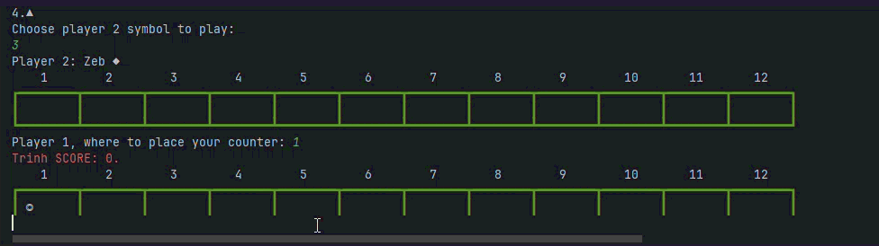

# Results of Testing

The test results show the actual outcome of the testing, following the [Test Plan](test-plan.md)

---

## Input Player Names and Symbols - VALID

I will test that players can enter a name, symbol and it is accepted

### Test Data Used

I will try to enter a valid, non-blank name: Trinh, Zeb and valid number of symbol: 2,3

### Test Result

The test passed - only the valid names and symbols were accepted

---

## Input: Player Names and Symbols - INVALID

I will test that invalid (blank) names and symbols are rejected.

### Test Data To Use

I will try to enter a blank name and blank number of symbol and the invalid number for each player.

### Test Result

The test passed - the blank names, blank number and invalid number of symbols were rejected.

---

## Input: Player Counter Selection - VALID

I will test that players can select counters

### Test Data To Use

I will attempt to enter a valid counter number

I will do this for player 1 and player 2

### Test Result

The test passed - the counters were selected and moved

---

## Input: Player Counter Selection - BOUNDARIES

I will test the boundaries of the counter input

### Test Data To Use

I will attempt to select counters at position 1 and position 12, the boundaries of the board

I will do this for player 1 and player 2

### Test Result

Player 1:

Player 2:

The test passed - the counters in positions 1 and 12 were selected ok

---

## Input: Player Counter Selection - INVALID

I will test that invalid counter inputs are rejected

### Test Data To Use

I will attempt to:

- Enter a blank
- Enter a word: **boy**
- Enter a number that is out of range: **0, 13**
- Enter a valid number between 2 opponent counters

I will do this for player 1 and player 2

### Test Result

Video: [counter-place-3.mp4](screenshots/counter-place-3.mp4)

The test passed - the invalid inputs were all rejected

---

## Gameplay: Explosion

I will test that is the counter will remove if it has 3 or more counter adjacent.

### Test Data To Use

I will attempt to:

- Enter 3 counters adjacent
- Enter 4 counters adjacent
- Enter 5 counters adjacent
  I will do this for both player

### Test Result

3 and 4 counters adjacent:

5 counters adjacent:

The test passed - all of them are working

## Gameplay: Defuse rule

I will test that is defused rule working

### Test Data To Use

I will attempt to put the counters on each side of opponent counter

I will do that for player 1 and player 2

### Test Result

The test passed - the defused rule did work
---

## Gameplay: Win and Score

I will test that is the game count the score of each player and is the score win work

### Test Data To Use

I will attempt to:

- Check if the score count work
- Check if the winning work

I will do this for player 1 and player 2

### Test Result

Player 1:

Player 2:

Video: [player-2-win-score.mp4](screenshots/player-2-win-score.mp4)

The test passed - all of them are working well, no error